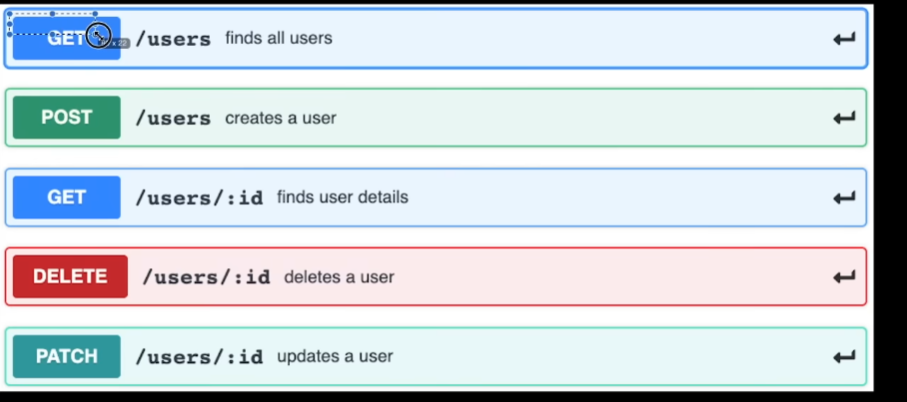

# Project Goal : 




Express = server framework 
alternatives = Nestjs , fastify


Commands learn
    1.npm init -y = start bare minimun give package.json 
    2.npm install --save-dev nodemon : To keep your server / index.jx auto run if (something changed)
    {Also add Script : start for nodemon

    "scripts": {
        "start": "nodemon index.js"
        },
    }

Note: -dev means install only for development purpose build ke time ni install hoga 
Dpendencies installed 

// gpt se step extract karwa lo jo jo package/dependencies installed kiiye 

# Lesson 1: setup basic express server. 

    1. index.js = starting point of our server 
    2. Install and import express : npm install express
    3. package.json mein ja ke "type" : "module" : This tells Node.js to treat .js files as ES modules, allowing you to use import/export instead of require/module.exports.
    4. nodemon ke liye sript bhi add kr dena .


# Lesson 2 : Route setup.

    1.Create routes folder , and each routes inside the folder 
```js
const router = express.Router();

router.get('/', (req, res) => {
  console.log(users);
  res.send(users);
});
```

    2.npm install uuid : to assign unique id to each users. and import {import { v4 as uuidv4 } from 'uuid';}
    3.learned how to setup .POST 


```js
router.post('/', (req, res) => {


  const newUser = req.body; // this is the new user data sent in the request body
  users.push({...newUser , id: uuidv4()}); // add the new user to the users array
  res.send(`${newUser.firstName} added successfully`);

});
``` 
# Lesson 3 : DELETE /users/:id

```js
router.delete('/:id', (req, res) => {
  // :id is a route parameter
  // localhost:5000/users/123 → req.params.id = 123

  const { id } = req.params;
  // destructuring id from request params

  // params = localhost:5000/users/ ke baad jo bhi aayega wo id hoga
  users = users.filter(user => user.id !== id);

  res.send(`User with id ${id} deleted successfully`);
});
```

# Lesson 4 : PATCH : partically modify something


```js
router.patch('/:id',(req,res)=>{

    const {id} = req.params;
    
    const {firstName , lastName , age} = req.body;
    const userToBeUpdated = users.find((user)=> user.id ===id);
    
    if(firstName) userToBeUpdated.firstName = firstName;
    if(lastName) userToBeUpdated.lastName = lastName;
    if(age) userToBeUpdated.age = age;


    res.send(`User with id ${id} updated successfully`);
   
})
```


# Lesson 5: Controllers Folder 

    1. Create controller folder and keep your funtion here for clean code.
example:    
```js
import { v4 as uuidv4 } from 'uuid';
let users =[]

export const getUsers =  (req, res) => {
  console.log(users);
  res.send(users);
}
```
